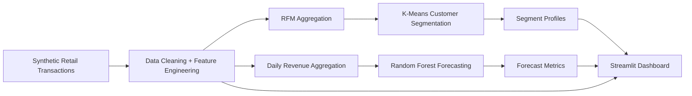
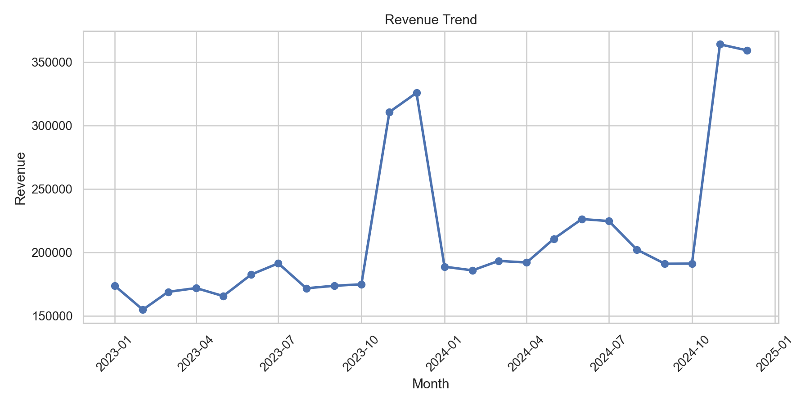
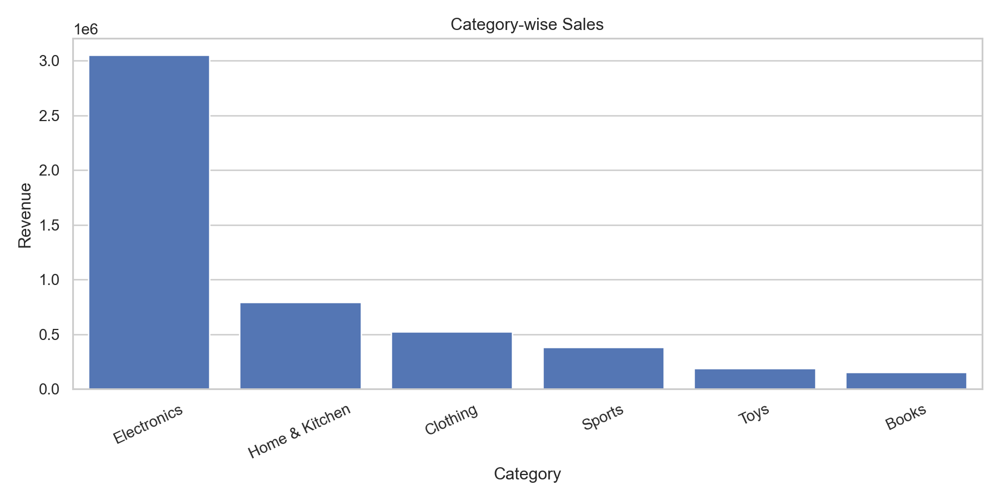
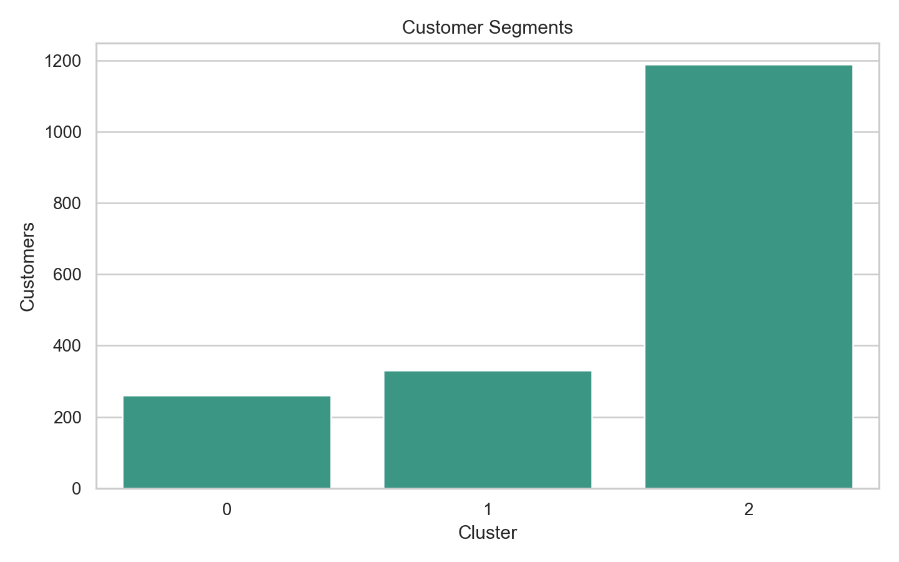
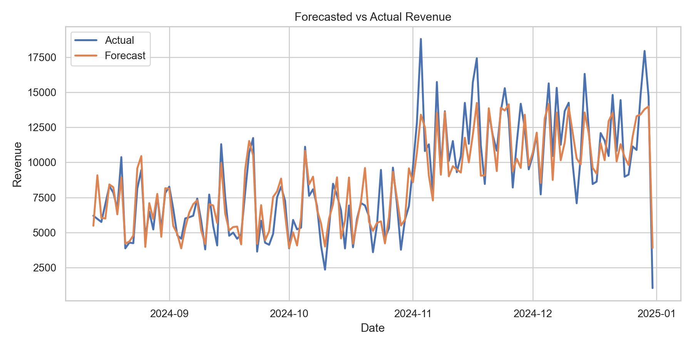

# Sales Analytics & Forecasting with ML

End-to-end retail analytics pipeline using a **synthetic transaction dataset** for customer segmentation, revenue forecasting, outlier detection, and interactive business insight generation.

## What This Project Does

- Generates a realistic synthetic retail sales dataset with seasonality, discounts, missing values, and outliers
- Cleans and enriches the dataset with time-based analytical features
- Builds **RFM-style customer segments** using **K-Means clustering**
- Forecasts daily revenue using a **Random Forest Regressor**
- Exports recruiter-friendly metrics to `metrics.json`
- Powers an interactive **Streamlit dashboard** for business exploration

## Tech Stack

- Python
- Pandas
- NumPy
- scikit-learn
- Streamlit
- Plotly
- Matplotlib
- Seaborn
- Joblib

## Project Pipeline

```text
Data Generation -> Preprocessing -> Customer Segmentation -> Forecasting -> Visualizations -> Metrics Export
```

## Architecture



## Screenshots

### Revenue Trend


### Category-wise Sales


### Customer Segments


### Forecasted vs Actual Revenue


## Project Structure

```text
sales-analytics-ml/
├── app.py
├── generate_data.py
├── main.py
├── metrics.json
├── README.md
├── requirements.txt
├── screenshots/
└── src/
    ├── analytics.py
    ├── clustering.py
    ├── config.py
    ├── data_generation.py
    ├── data_preprocessing.py
    ├── forecasting.py
    └── pipeline.py
```

## How to Run

### 1. Install dependencies

```bash
pip install -r requirements.txt
```

### 2. Run the end-to-end pipeline

```bash
python main.py
```

### 3. Launch the dashboard

```bash
streamlit run app.py
```

## Key Outputs

- `data/raw/sales_data.csv`
- `data/processed/sales_data_cleaned.csv`
- `data/processed/customer_segments.csv`
- `data/processed/daily_revenue_forecast.csv`
- `models/random_forest_forecaster.joblib`
- `metrics.json`

## Key Engineering Decisions

- Used a **synthetic retail dataset** so the project is safe to share publicly while still demonstrating realistic business variability.
- Chose **RFM-style customer features** because they are interpretable for recruiters, analysts, and product teams.
- Used **Random Forest forecasting** for a strong baseline that handles non-linear retail patterns without heavy tuning.
- Exported **metrics and preview charts** so repo visitors can validate claims without running the full project first.
- Added a **Streamlit dashboard** to convert the notebook-style pipeline into a visible product demo.

## Example Metrics

The pipeline writes project metrics to `metrics.json`, including:

- record count
- unique customers
- Random Forest R²
- MAE / RMSE
- optimal cluster count
- silhouette score
- outlier rate

## Limitations

- The dataset is synthetic and not sourced from a real retailer.
- Forecasting is based on aggregated daily revenue, not SKU-level demand planning.
- The project is Streamlit-first and does not yet expose a FastAPI or production service layer.
- There is no authentication, scheduling, or database persistence yet.

## Roadmap

- Add real dataset support and configurable schema ingestion
- Add SKU-level and region-level forecasting views
- Persist experiments and metrics to a database
- Add unit tests and CI checks
- Add Docker and Streamlit Cloud deployment config

## Resume-ready Project Summary

Built an end-to-end retail analytics pipeline using synthetic transaction data, K-Means customer segmentation, Random Forest revenue forecasting, anomaly handling, and an interactive Streamlit dashboard for business insight generation.
